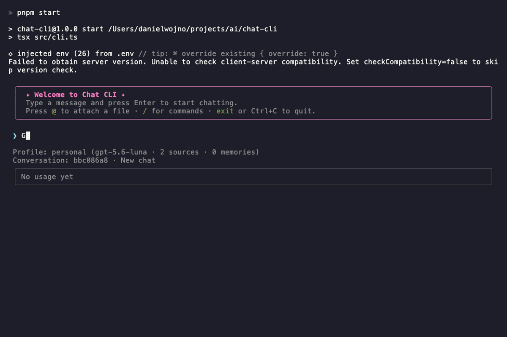

# chat-cli

A **frameworkless AI agent** in your terminal — the agent loop, context management, tool calling, and sub-agent delegation are all hand-built on the raw OpenAI SDK. No agent framework, nothing hiding the mechanics. Streaming replies land in an [Ink](https://github.com/vadimdemedes/ink) (React) TUI.

The point isn't the chat — it's the machinery underneath. Every layer an agent framework hides behind its magic is here in plain sight and under direct control: the request loop, the token budget, the tool wiring, the sub-agent handoffs. If you've ever wanted to see what actually happens when an "agent" thinks, this is the whole thing, unabstracted.

<p align="center">
  
</p>

<sub>Demo recorded with [VHS](https://github.com/charmbracelet/vhs) — run `vhs demo.tape` to regenerate [`docs/demo.gif`](docs/demo.gif).</sub>

## What it does

- **Stateless agent loop** — runs the model → tool-call → tool-result cycle by hand until the model stops asking for tools, then streams the answer. Takes the transcript in, keeps nothing after the turn. Independent tool calls in a single turn run in parallel. [`agent.ts`](src/agent/agent.ts)
- **Context-window management** — only the last 4 turns are kept verbatim; older turns fold into a rolling summary and are dropped, keeping a stable, cacheable prompt prefix. Owned by the session, not the agent. [`summarizer.ts`](src/agent/tokens/summarizer.ts), [`session.ts`](src/integration/session.ts)
- **Prompt caching** — out-of-window state (memories + summary) is pinned to the _end_ of the input so a `/remember` or a re-summarization never invalidates the cached prefix above it.
- **Sub-agent delegation** — the model can spin up ephemeral child agents for multi-step work — several in parallel — each with its own context and tools, handing back a compressed digest. The sub-agent's tool activity streams back live under a short, model-chosen label. [`delegate-task.ts`](src/integration/tools/delegate-task.ts), [`handoff.ts`](src/agent/tools/utils/handoff.ts)
- **Live activity trace** — every tool call and delegation surfaces as a streaming, Gemini-style "thinking" step (with its target — the city, the search query, the sub-task) that freezes above the final answer instead of vanishing. [`ui/`](src/ui/)
- **Injected tools** — the agent core ships with _no_ tools; the host composes them as one `ToolDefinition` type and injects a main set + a fork set. Tool operations are async generators, so long-running ones (grep, indexing) stream progress to the UI. Built-ins are a demo weather lookup and a keyless Wikipedia web search; compose your own in [src/integration/tools/](src/integration/tools/). [`createAgentTools`](src/integration/tools/index.ts)
- **Knowledge base (RAG)** — `/learn @file` converts a source (md/txt/code, PDF, DOCX, HTML, XLSX, CSV) to Markdown, uploads it to a per-profile MinIO bucket, chunks it (heading-aware, line-tracked), and indexes it in a per-profile Qdrant collection using **hybrid dense + sparse search fused with RRF**. The agent gets four store-backed tools — `search_knowledge_base` (returns file + line ranges), `list_files`, `grep_files` (streamed from object storage), and `read_file` (line/byte ranges). The whole pipeline lives in the `sources` store domain behind its facade; the agent core stays RAG-agnostic. [`src/store/sources/`](src/store/sources/)
- **Relevance reranking** — RRF fusion is recall-first: it returns the top-N regardless of how relevant each hit actually is, so the agent "gets all the things." `search_knowledge_base` over-fetches a larger candidate pool, has an **LLM reranker** rescore it against the query (0–1 relevance), drops hits below a fraction of the top score, and keeps only the best — fewer, on-topic passages returned whole (heading breadcrumb + full chunk, not a mid-sentence 320-char cut). Degrades gracefully to fused order if the rerank call fails, and toggles off (`RAG_RERANK_ENABLED=false`) for a pure-RRF baseline. [`reranker.ts`](src/store/sources/rag/reranker.ts), [`engine.ts`](src/store/sources/rag/engine.ts)
- **Structured output** — replies validated against a Zod schema, plus a raw JSON mode.
- **Prompt evals** — behavioural tests that grade the prompts and tools against the live model. See [evals/](evals/).
- **Tests** — a Vitest suite (unit + end-to-end) that mocks the model, covering the agent loop, tool failures, delegation, and the UI — fast and fully offline. See [tests/](tests/).

## Setup

```bash
pnpm install
echo "OPENAI_API_KEY=sk-..." > .env
pnpm start
```

- `pnpm dev` — start with file-watch reload
- `pnpm typecheck` — type-check without emitting
- `pnpm test` — run the unit + e2e tests (model mocked; no API key needed)
- `pnpm eval` — run the prompt evals against the live model ([details](src/eval/))

### Knowledge base (RAG) services

The `/learn` pipeline needs MinIO (S3) and Qdrant. Start them with Docker and copy the RAG env vars:

```bash
pnpm infra:start              # MinIO on :9000 (console :9001), Qdrant on :6333
cp .env.example .env          # then set OPENAI_API_KEY; defaults point at localhost
```

`pnpm infra:stop` stops the services (keeping data); `pnpm infra:clear` also wipes their volumes.

Defaults (endpoints, credentials, embedding model `text-embedding-3-small`, sparse model `Qdrant/bm25`, chunk sizes) live in [`.env.example`](.env.example). Each profile gets its own bucket (`chat-cli-<profile>`) and Qdrant collection (`kb_<profile>`). The offline test suite fakes these services; to exercise the real ones end to end:

```bash
RAG_INTEGRATION=1 pnpm test tests/store/rag/live.integration.test.ts
```

## Usage

```bash
pnpm start                            # start a fresh conversation
pnpm start -- --conversation <uuid>   # -c for short; resume a previous conversation
```

At the `>` prompt, type a message for a streaming reply, or use a command:

| Command                | Description                                                              |
| ---------------------- | ------------------------------------------------------------------------ |
| `/remember <memory>`   | Pin a memory; injected into every later turn (survives truncation)       |
| `/learn @file [@…]`    | Convert, upload, chunk, embed and index files for RAG                    |
| `/sources`             | List the files indexed in the current profile                           |
| `/reindex`             | Re-index every source in the current profile                            |
| `/profile`             | Switch or create a profile — each has its own bucket, collection + memory |
| `/conversation`        | Switch or start a conversation (chat session) within the current profile |
| `/json <prompt>`       | Reply in JSON output mode                                                |
| `/structured <prompt>` | Reply validated against a Zod schema (answer + sources)                  |
| `exit`                 | Leave the REPL (Ctrl+C / Ctrl+D also work)                               |

`/profile` and `/conversation` open an interactive picker: choose an existing entry or create a new one, and the transcript, summary, pinned memories, and knowledge base swap to that context. A **profile** is an isolated workspace (its own MinIO bucket, Qdrant collection, and pinned memories); a **conversation** is a distinct chat thread inside a profile, so you can keep several running side by side without their histories bleeding together.

### Attaching files with `@file`

Prefix any path with `@` to pull that file into the model's context — it works in a normal message, not just `/learn`. On send, each `@path` is resolved relative to the current directory and its contents are inlined into the prompt wrapped in a `<file path="…">` block:

```
> summarize @src/agent/agent.ts and compare it to @docs/architecture.md
```

Mentions are sandboxed to the working directory (no escaping via `..` or symlinks), binary files are skipped, and reads are capped (32 KB per file, 100 KB total) so a stray `@node_modules/...` can't blow the context window. Use `@file` for a one-off look at a file in the current turn; use `/learn @file` to persist it into the searchable knowledge base for every later turn.

On exit, a token-savings report compares actual input tokens against a naive "re-send everything" baseline — the payoff of the context management above.

## How the agent loop works

Each turn, the service sends the trimmed conversation plus a context block (pinned memories + rolling summary) to the model. If the response contains tool calls, it executes them — independent calls in the same turn run concurrently — appends the results, and asks again, looping until the model answers with no further calls. A tool that throws or rejects — a bad argument, a failed request, a timeout — becomes an error result fed back to the model rather than aborting the turn, so it can recover. Delegation is just a tool: `delegate_task` runs one sub-task and `delegate_tasks` fans out several in parallel, each as a child agent running the same loop under a fork profile (`general` web tools, or `rag_research` knowledge-base tools) — their activity streams back live and each transcript is compressed into a structured handoff folded into the thread. The orchestrator runs `gpt-4o`; forks and the summarizer/handoff run `gpt-4o-mini`.

After each answer, the window is trimmed deterministically: keep the last 4 turns, summarize and evict the rest. State (full transcript, summary, pinned memories, sources, usage) persists to `.chat-state/chat.db` between runs. For the full mechanics see [docs/agent-loop.md](docs/agent-loop.md).

## Structure

```
src/
  main.ts           composition root — build every dependency once
  agent/            PURE core: loop, summarizer, fork/handoff, events, prompts
                    (tool-agnostic — tools are injected by the host)
  ui/               Ink chat + activity trace + markdown (components/hooks/input)
  integration/      adapters + wiring: session, OpenAI client, REPL, CLI args,
                    file-mentions, commands, and all tools (weather/web-search/
                    delegate + RAG) composed and injected into the agent
  store/            store facade + domain facades (profile, conversation, memory,
                    sources); sources/ owns the RAG pipeline behind its facade
  db/               SQLite connection, schema, migrations
tests/              vitest unit + e2e suites (model mocked; mirrors src/)
evals/              prompt evals against the live model (evalite)
docs/               architecture notes (see docs/architecture.md)
```

See [docs/architecture.md](docs/architecture.md) for how the layers fit together,
[docs/agent-loop.md](docs/agent-loop.md) for the turn/delegation mechanics, and
[docs/rag.md](docs/rag.md) for the knowledge-base pipeline.
