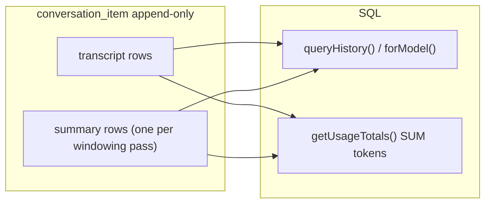
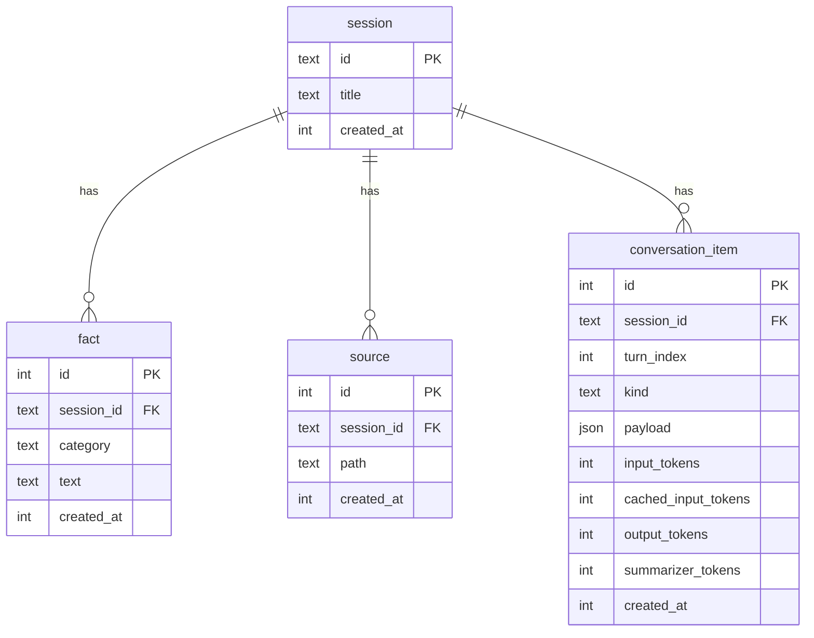

# Persistence: SQLite + Drizzle

chat-cli persists durable state behind a top-level [`Store`](../src/store/store.ts)
facade. The store composes three namespaced clients —
[`conversation`](../src/store/conversation/client.ts) (transcript, summaries,
usage), [`fact`](../src/store/fact/client.ts) (pinned facts), and
[`sources`](../src/store/sources/client.ts) (learned file paths). SQLite is the
current backend for all three; its schema is documented below.

## Store (top-level facade)

[`Session`](../src/integration/session.ts) and the commands depend on `Store`
and its namespaces, never on SQLite directly:

```ts
const store = await LocalStore.open(DB_PATH);
const session = await Session.create(agent, openai, store, KEEP_LAST_TURNS);

await store.conversation.appendItems(items);
await store.fact.add("likes tea");
await store.sources.add(["src/a.ts"]);
```

| Type                                                        | Role                                         |
| ----------------------------------------------------------- | -------------------------------------------- |
| [`Store`](../src/store/store.ts)                            | Top-level facade — `sessionId` + namespaces  |
| [`LocalStore`](../src/store/store.ts)                       | SQLite bundle (`open(path)` or `":memory:"`) |
| [`ConversationClient`](../src/store/conversation/client.ts) | Transcript, summaries, token usage           |
| [`FactClient`](../src/store/fact/client.ts)                 | Pinned facts                                 |
| [`SourcesClient`](../src/store/sources/client.ts)           | Learned source paths (deduped)               |

Each namespace's only implementation lives under
[`src/store/sqlite/`](../src/store/sqlite/); nothing outside `sqlite/` imports
Drizzle or `better-sqlite3`. Tests run against the same SQLite code via
`LocalStore.open(":memory:")`, so they exercise the real SQL — there is no
separate in-memory stand-in to drift from production behaviour.

### Future backends (not implemented)

A remote or Postgres backend is a new `Store` whose namespaces call `fetch()`
(or another driver) instead of SQL — no `Session` or agent changes:

```ts
class CloudStore implements Store {
  readonly conversation: ApiConversationClient;
  readonly fact: ApiFactClient;
  readonly sources: ApiSourcesClient;
}
```

File-blob (S3) and vector-search (Qdrant) namespaces can be added the same way
when those features land.

## Design principles

1. **Never store what SQL can derive** — token totals, turn counts, and the
   naive baseline are computed at read time, never cached in a row.
2. **`conversation_item` is append-only** — no `UPDATE` or `DELETE`, ever. Each
   windowing pass **inserts** a new `kind = 'summary'` row; older summary rows
   remain as an audit trail.
3. **The rolling summary is session-scoped, not durable** — it exists only to
   shrink the live context window while a process runs. Summary rows are written
   (for summarizer-token accounting + audit) but never returned as history items;
   on restart the summary starts empty and rebuilds from the restored window as it
   overflows.

| Stored (source of truth)                | Derived (SQL / pure fn at read time)            |
| --------------------------------------- | ----------------------------------------------- |
| Per-item token columns on anchor rows   | `SUM(input_tokens)`, `SUM(output_tokens)`, etc. |
| `kind = 'message'` + `role = user` rows | turn count                                      |
| All item payloads                       | naive baseline estimate                         |

## On-disk layout

| Path                  | Purpose                                                                           |
| --------------------- | --------------------------------------------------------------------------------- |
| `.chat-state/chat.db` | SQLite database (WAL mode) — all persisted state                                  |
| `.chat-state/active`  | Plain-text pointer to the active session UUID (runtime preference, not in the DB) |

The whole `.chat-state/` directory is gitignored.

## Read patterns

| Concern          | SQL query                     | Used for                 |
| ---------------- | ----------------------------- | ------------------------ |
| **Transcript**   | `queryHistory()`              | UI replay + model window |
| **Usage totals** | `SUM(...)` over token columns | status bar, `/report`    |
| **Facts**        | `fact` table, `ORDER BY id`   | `buildContextBlock()`    |

`queryHistory()` is the fluent transcript read API. Summary rows are never
returned as UI history items; `forModel()` reads the latest summary text from the
store and injects it once as a prepended `developer` message, replacing evicted
turns excluded by `afterLastSummary()`. Window size is enforced by summarization
(`maintainWindow`), not by capping the read.



## ER diagram



## Tables

### `session` — identifiable, browsable chat sessions

| Column       | Type                               | Notes                                        |
| ------------ | ---------------------------------- | -------------------------------------------- |
| `id`         | `TEXT PK`                          | UUID (`crypto.randomUUID()`)                 |
| `title`      | `TEXT NOT NULL DEFAULT 'New chat'` | Human-readable label for the session browser |
| `created_at` | `INTEGER NOT NULL`                 | Unix ms                                      |

- `id` is a UUID, not a sentinel like `'default'`.
- `title` is user-facing and updatable — the session row is the one exception to
  the append-only rule (it is metadata, not transcript).
- Last activity is derived, not stored: `MAX(conversation_item.created_at)`.

Browse query:

```sql
SELECT s.id, s.title, s.created_at,
  (SELECT MAX(ci.created_at) FROM conversation_item ci
   WHERE ci.session_id = s.id) AS last_activity_at
FROM session s
ORDER BY last_activity_at DESC, s.created_at DESC;
```

### `fact` — pinned user notes (`/remember`)

| Column       | Type                              | Notes              |
| ------------ | --------------------------------- | ------------------ |
| `id`         | `INTEGER PK AUTOINCREMENT`        | Order by `id ASC`  |
| `session_id` | `TEXT NOT NULL FK → session.id`   |                    |
| `category`   | `TEXT NOT NULL DEFAULT 'general'` | Free-form grouping |
| `text`       | `TEXT NOT NULL`                   | Fact body          |
| `created_at` | `INTEGER NOT NULL`                |                    |

### `source` — RAG file registry (`/learn`)

| Column       | Type                            | Notes             |
| ------------ | ------------------------------- | ----------------- |
| `id`         | `INTEGER PK AUTOINCREMENT`      | Order by `id ASC` |
| `session_id` | `TEXT NOT NULL FK → session.id` |                   |
| `path`       | `TEXT NOT NULL`                 | cwd-relative      |
| `created_at` | `INTEGER NOT NULL`              |                   |

- Unique: `(session_id, path)` — dedupes repeat `/learn` of the same file.

### `conversation_item` — append-only transcript + summaries + token usage

| Column                | Type                            | Notes                                                         |
| --------------------- | ------------------------------- | ------------------------------------------------------------- |
| `id`                  | `INTEGER PK AUTOINCREMENT`      | Order by `id ASC`                                             |
| `session_id`          | `TEXT NOT NULL FK → session.id` |                                                               |
| `turn_index`          | `INTEGER`                       | `NULL` for `kind = 'summary'`                                 |
| `kind`                | `TEXT NOT NULL`                 | `message \| function_call \| function_call_output \| summary` |
| `payload`             | `TEXT NOT NULL`                 | JSON — shape depends on `kind`                                |
| `input_tokens`        | `INTEGER NOT NULL DEFAULT 0`    |                                                               |
| `cached_input_tokens` | `INTEGER NOT NULL DEFAULT 0`    |                                                               |
| `output_tokens`       | `INTEGER NOT NULL DEFAULT 0`    |                                                               |
| `summarizer_tokens`   | `INTEGER NOT NULL DEFAULT 0`    | Non-zero on `kind = 'summary'` rows                           |
| `created_at`          | `INTEGER NOT NULL`              |                                                               |

Payload shapes per `kind`:

| `kind`                 | `payload`                                                |
| ---------------------- | -------------------------------------------------------- |
| `message`              | `{ role, content }` — an OpenAI `ResponseInputItem`      |
| `function_call`        | `{ type, call_id, name, arguments }`                     |
| `function_call_output` | `{ type, call_id, output }`                              |
| `summary`              | `{ content: string }` — rolling digest at time of insert |

Indexes:

- `(session_id, turn_index)` — window queries
- `(session_id, kind, id)` — fast latest-summary lookup

There is no partial unique index on summary rows: multiple summary rows per
session are intentional.

## Summary: append, never update

Each windowing pass:

1. Read the latest summary (`ORDER BY id DESC LIMIT 1`) → prior text (or `""`).
2. Query the evicted transcript rows.
3. Call the summarizer with `priorSummary + evictedItems`.
4. **INSERT** a new `kind = 'summary'` row with `{ content }` and
   `summarizer_tokens`.

Older summary rows stay in the table. The model always uses only the latest.

## Token usage: anchor row pattern

One API call can produce several `conversation_item` rows. Token usage is
written only on the **last row** of that batch; all others get `0`. This keeps
`SUM()` correct without a separate usage table.

| Insert event               | Token columns                             |
| -------------------------- | ----------------------------------------- |
| User message               | all `0`                                   |
| Tool output                | all `0`                                   |
| Items from an API response | usage on the last row of the batch        |
| Fork handoff row           | the delegated sub-agent's rolled-up usage |
| New summary row            | `summarizer_tokens`; others `0`           |

```sql
SELECT
  COALESCE(SUM(input_tokens), 0)        AS actual_input,
  COALESCE(SUM(cached_input_tokens), 0) AS cached_input,
  COALESCE(SUM(output_tokens), 0)       AS output_tokens,
  COALESCE(SUM(summarizer_tokens), 0)   AS summarizer_tokens
FROM conversation_item WHERE session_id = ?;
```

## Runtime assembly

```ts
const messages = await store.conversation.queryHistory().forModel().execute();
const facts = await store.fact.list();

const apiInput = [
  ...messages, // full unsummarized tail; summary prepended once when present
  ...buildContextBlock({ facts }), // facts-only tail for prompt cache
];
```

`forModel()` excludes evicted transcript rows (`afterLastSummary`) and injects
the latest summary row's text once — it is not duplicated in `buildContextBlock`.

## Migrations

Schema lives in
[`src/store/sqlite/schema.ts`](../src/store/sqlite/schema.ts).
SQL migrations are generated by drizzle-kit and applied automatically on startup.

```bash
pnpm db:generate --name <change>   # regenerate SQL after editing schema.ts
pnpm db:studio                     # browse the database
```

Migrations run on every open
([`src/store/sqlite/db.ts`](../src/store/sqlite/db.ts));
once the schema is current it is a no-op, so there is no separate setup step.

## Code map

| File                                                                      | Role                                    |
| ------------------------------------------------------------------------- | --------------------------------------- |
| [`src/store/store.ts`](../src/store/store.ts)                             | `Store` facade + `LocalStore` bundle    |
| [`src/store/types.ts`](../src/store/types.ts)                             | Storage-agnostic domain types           |
| [`src/store/derive.ts`](../src/store/derive.ts)                           | Pure window/usage helpers               |
| [`src/store/conversation/client.ts`](../src/store/conversation/client.ts) | Abstract `ConversationClient`           |
| [`src/store/fact/client.ts`](../src/store/fact/client.ts)                 | Abstract `FactClient`                   |
| [`src/store/sources/client.ts`](../src/store/sources/client.ts)           | Abstract `SourcesClient`                |
| [`src/store/sqlite/schema.ts`](../src/store/sqlite/schema.ts)             | Drizzle table definitions               |
| [`src/store/sqlite/db.ts`](../src/store/sqlite/db.ts)                     | Connection, WAL, migrations             |
| [`src/store/sqlite/sessions.ts`](../src/store/sqlite/sessions.ts)         | Active-session pointer + `listSessions` |
| [`src/store/sqlite/conversation.ts`](../src/store/sqlite/conversation.ts) | SQLite `ConversationClient`             |
| [`src/store/sqlite/fact.ts`](../src/store/sqlite/fact.ts)                 | SQLite `FactClient`                     |
| [`src/store/sqlite/sources.ts`](../src/store/sqlite/sources.ts)           | SQLite `SourcesClient`                  |
| `src/store/sqlite/migrations/`                                            | drizzle-kit generated SQL + journal     |

## Deliberate non-goals (v1)

- **Session browser UI** — schema and `listSessions()` are ready; the TUI picker
  is a follow-up.
- **UPDATE/DELETE on `conversation_item`** — strictly append-only.
- **Storing `last_activity_at`** — derived from `conversation_item`.
- **Showing summary rows in UI chat** — excluded from the history query.
