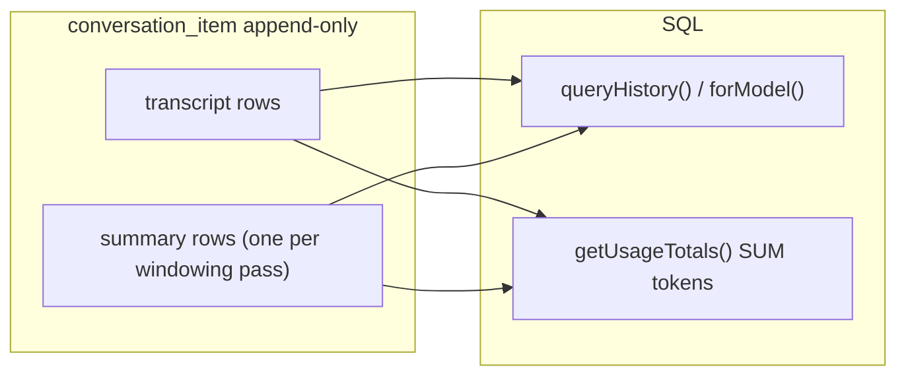
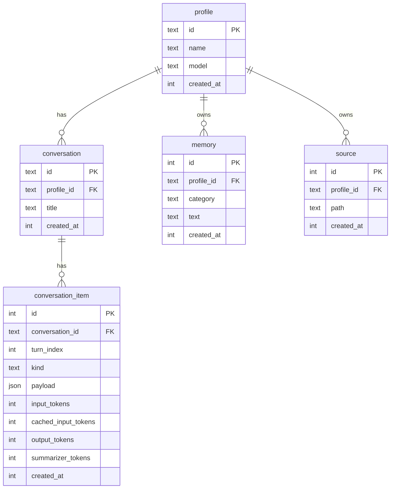

# Persistence: SQLite + Drizzle

chat-cli persists durable state behind a top-level [`Store`](../src/store/index.ts)
facade. The store composes namespaced domain facades —
[`profile`](../src/store/profile/index.ts) (settings), [`conversation`](../src/store/conversation/index.ts) (transcript, summaries,
usage), [`memory`](../src/store/memory/index.ts) (pinned memories), and
[`sources`](../src/store/sources/index.ts) (learned file paths). SQLite is the
current backend; its schema is documented below.

## Store (top-level facade)

[`Session`](../src/integration/session.ts) and the commands depend on `Store`
and its namespaces, never on SQLite directly:

```ts
const store = await LocalStore.open(DB_PATH);
const session = await Session.create(agent, openai, store, KEEP_LAST_TURNS, bus);

await store.conversation.createItems(store.conversationId, items);
await store.memory.create(store.profileId, "likes tea");
await store.sources.create(store.profileId, "src/a.ts");

const profiles = await store.profile.query().execute();
const conversations = await store.conversation
  .query()
  .forProfile(store.profileId)
  .orderByLastActivity()
  .execute();
const memories = await store.memory.query().forProfile(store.profileId).execute();
const profile = await store.profile.query().byId(store.profileId).executeAndTakeFirst();
const conversation = await store.conversation
  .query()
  .byId(store.conversationId)
  .executeAndTakeFirst();
```

| Type                                                                     | Role                                              |
| ------------------------------------------------------------------------ | ------------------------------------------------- |
| [`Store`](../src/store/index.ts)                                         | Top-level facade — `profileId` + `conversationId` |
| [`LocalStore`](../src/store/store.ts)                                    | SQLite bundle (`open(path)` or `":memory:"`)      |
| [`ProfileFacade`](../src/store/profile/profile.facade.ts)                | Profile settings (model)                          |
| [`ConversationFacade`](../src/store/conversation/conversation.facade.ts) | Transcript, summaries, token usage                |
| [`MemoryFacade`](../src/store/memory/memory.facade.ts)                   | Pinned memories (profile-scoped)                  |
| [`SourcesFacade`](../src/store/sources/source.facade.ts)                 | Learned source paths (profile-scoped)             |

Each domain exposes a single public module (`index.ts`) with an abstract facade class
and a repository holding all SQL. [`src/db/`](../src/db/) holds schema, migrations,
and connection; the composition root in [`store.ts`](../src/store/store.ts) wires
facades with constructor injection. Tests run against the same SQLite code via
`LocalStore.open(":memory:")`, so they exercise the real SQL — there is no
separate in-memory stand-in to drift from production behaviour.

### Future backends (not implemented)

A remote or Postgres backend is a new `Store` whose namespaces call `fetch()`
(or another driver) instead of SQL — no `Session` or agent changes:

```ts
class CloudStore implements Store {
  readonly profile: ApiProfileFacade;
  readonly conversation: ApiConversationFacade;
  readonly memory: ApiMemoryFacade;
  readonly sources: ApiSourcesFacade;
}
```

File-blob (S3) and vector-search (Qdrant) namespaces can be added the same way
when those features land.

## Design principles

1. **Never store what SQL can derive** — token totals, turn counts, and the
   naive baseline are computed at read time, never cached in a row.
2. **`conversation_item` is append-only** — no `UPDATE` or `DELETE`, ever. Each
   windowing pass **inserts** a new `kind = 'summary'` row; older summary rows
   remain as an audit trail.
3. **The rolling summary is conversation-scoped, not durable** — it exists only to
   shrink the live context window while a process runs. Summary rows are written
   (for summarizer-token accounting + audit) but never returned as history items;
   on restart the summary starts empty and rebuilds from the restored window as it
   overflows.

| Stored (source of truth)                | Derived (SQL / pure fn at read time)            |
| --------------------------------------- | ----------------------------------------------- |
| Per-item token columns on anchor rows   | `SUM(input_tokens)`, `SUM(output_tokens)`, etc. |
| `kind = 'user_message'` rows            | turn count                                      |
| All item payloads                       | naive baseline estimate                         |

## On-disk layout

| Path                      | Purpose                                                       |
| ------------------------- | ------------------------------------------------------------- |
| `.chat-state/chat.db`     | SQLite database (WAL mode) — all persisted state              |
| `.chat-state/active.json` | JSON pointer to the active profile (`{ "profileId": "..." }`) |
| `.chat-state/sources/`    | Converted-Markdown RAG blobs (when `RAG_BLOB_BACKEND=disk`, the default) |

The whole `.chat-state/` directory is gitignored.

## Read patterns

| Concern          | SQL query                                     | Used for                 |
| ---------------- | --------------------------------------------- | ------------------------ |
| **Transcript**   | `queryHistory()`                              | UI replay + model window |
| **Usage totals** | `SUM(...)` over token columns                 | status bar, `/report`    |
| **Memories**     | `memory` table, profile-scoped, `ORDER BY id` | the reducer's `buildMessage()` |

`queryHistory()` is the fluent transcript read API, returning `AgentEvent[]`. Summary
rows are never returned; `forModel()` just excludes evicted rows via
`afterLastSummary()`. The rolling summary text is read separately
(`readLatestSummaryText()`) and rides in `TurnContext.summary` — the reducer folds it
into the packed prompt, so the store no longer injects a synthetic `developer`
message. Window size is enforced by summarization (`maintainWindow`), not by capping
the read.



## ER diagram



## Tables

### `profile` — settings and memory scope

| Column       | Type               | Notes                                               |
| ------------ | ------------------ | --------------------------------------------------- |
| `id`         | `TEXT PK`          | Slug (`personal` is the default, seeded on migrate) |
| `name`       | `TEXT NOT NULL`    | Display name in the profile picker                  |
| `model`      | `TEXT`             | Optional per-profile model override                 |
| `created_at` | `INTEGER NOT NULL` | Unix ms                                             |

- Temperature is code-defined (a `TEMPERATURE` constant), not a per-profile column.
- Memories and sources belong to a profile, not a conversation — switching
  conversation keeps memory; switching profile does not.
- The active profile id is persisted in `.chat-state/active.json` (not in the DB).

### `conversation` — identifiable, browsable chat threads

| Column       | Type                               | Notes                                            |
| ------------ | ---------------------------------- | ------------------------------------------------ |
| `id`         | `TEXT PK`                          | UUID (`crypto.randomUUID()`)                     |
| `profile_id` | `TEXT NOT NULL FK → profile.id`    | Owning profile                                   |
| `title`      | `TEXT NOT NULL DEFAULT 'New chat'` | Human-readable label for the conversation picker |
| `created_at` | `INTEGER NOT NULL`                 | Unix ms                                          |

- `id` is a UUID, not a sentinel like `'default'`.
- `title` is user-facing and updatable — the conversation row is the one exception to
  the append-only rule (it is metadata, not transcript).
- Last activity is derived, not stored: `MAX(conversation_item.created_at)`.

Browse query:

```sql
SELECT c.id, c.profile_id, c.title, c.created_at,
  (SELECT MAX(ci.created_at) FROM conversation_item ci
   WHERE ci.conversation_id = c.id) AS last_activity_at
FROM conversation c
WHERE c.profile_id = ?
ORDER BY last_activity_at DESC, c.created_at DESC;
```

### `memory` — pinned user notes (`/remember`)

| Column       | Type                              | Notes              |
| ------------ | --------------------------------- | ------------------ |
| `id`         | `INTEGER PK AUTOINCREMENT`        | Order by `id ASC`  |
| `profile_id` | `TEXT NOT NULL FK → profile.id`   |                    |
| `category`   | `TEXT NOT NULL DEFAULT 'general'` | Free-form grouping |
| `text`       | `TEXT NOT NULL`                   | Memory body        |
| `created_at` | `INTEGER NOT NULL`                |                    |

Renamed from `fact` in migration `0003_rename_fact_to_memory`.

### `source` — RAG file registry (`/learn`)

| Column       | Type                            | Notes             |
| ------------ | ------------------------------- | ----------------- |
| `id`         | `INTEGER PK AUTOINCREMENT`      | Order by `id ASC` |
| `profile_id` | `TEXT NOT NULL FK → profile.id` |                   |
| `path`       | `TEXT NOT NULL`                 | cwd-relative      |
| `created_at` | `INTEGER NOT NULL`              |                   |

- Unique: `(profile_id, path)` — dedupes repeat `/learn` of the same file.

### `conversation_item` — append-only transcript + summaries + token usage

| Column                | Type                                 | Notes                                                         |
| --------------------- | ------------------------------------ | ------------------------------------------------------------- |
| `id`                  | `INTEGER PK AUTOINCREMENT`           | Order by `id ASC`                                             |
| `conversation_id`     | `TEXT NOT NULL FK → conversation.id` |                                                               |
| `turn_index`          | `INTEGER`                            | `NULL` for `kind = 'summary'`                                 |
| `kind`                | `TEXT NOT NULL`                      | an `AgentEvent` type, or `summary` (free text — no migration to add a kind) |
| `payload`             | `TEXT NOT NULL`                      | JSON — the `AgentEvent` (or `{ content }` for a summary)      |
| `input_tokens`        | `INTEGER NOT NULL DEFAULT 0`         |                                                               |
| `cached_input_tokens` | `INTEGER NOT NULL DEFAULT 0`         |                                                               |
| `output_tokens`       | `INTEGER NOT NULL DEFAULT 0`         |                                                               |
| `summarizer_tokens`   | `INTEGER NOT NULL DEFAULT 0`         | Non-zero on `kind = 'summary'` rows                           |
| `created_at`          | `INTEGER NOT NULL`                   |                                                               |

Payload shapes per `kind` — the `kind` column is the `AgentEvent`'s `type`, and the
payload is the event verbatim (see [agent-loop.md](./agent-loop.md)):

| `kind`                 | `payload`                                                |
| ---------------------- | -------------------------------------------------------- |
| `user_message` / `human_response` / `assistant_answer` | `{ type, content, sources? }` |
| `tool_call`            | `{ type, id, name, args }`                               |
| `tool_result`          | `{ type, id, name, output }`                             |
| `error`                | `{ type, id, name, message }` — a compacted failure      |
| `approval_request` / `approval_response` | `{ type, id, … }`                      |
| `summary`              | `{ content: string }` — rolling digest at time of insert |

Indexes:

- `(conversation_id, turn_index)` — window queries
- `(conversation_id, kind, id)` — fast latest-summary lookup

There is no partial unique index on summary rows: multiple summary rows per
conversation are intentional.

## Summary: append, never update

Each windowing pass:

1. Read the latest summary (`ORDER BY id DESC LIMIT 1`) → prior text (or `""`).
2. Query the evicted transcript rows.
3. Call the summarizer with `priorSummary + evictedItems`.
4. **INSERT** a new `kind = 'summary'` row with `{ content }` and
   `summarizer_tokens`.

Older summary rows stay in the table. The model always uses only the latest.

## Token usage: anchor row pattern

One API call can produce several `conversation_item` rows. Token usage is
written only on the **last row** of that batch; all others get `0`. This keeps
`SUM()` correct without a separate usage table.

| Insert event               | Token columns                             |
| -------------------------- | ----------------------------------------- |
| User message               | all `0`                                   |
| Tool output                | all `0`                                   |
| Items from an API response | usage on the last row of the batch        |
| Fork handoff row           | the delegated sub-agent's rolled-up usage |
| New summary row            | `summarizer_tokens`; others `0`           |

```sql
SELECT
  COALESCE(SUM(input_tokens), 0)        AS actual_input,
  COALESCE(SUM(cached_input_tokens), 0) AS cached_input,
  COALESCE(SUM(output_tokens), 0)       AS output_tokens,
  COALESCE(SUM(summarizer_tokens), 0)   AS summarizer_tokens
FROM conversation_item WHERE conversation_id = ?;
```

## Runtime assembly

```ts
const events = await store.conversation.queryHistory(store.conversationId).forModel().execute();
const summary = await store.conversation.readLatestSummaryText(store.conversationId);
const memories = (await store.memory.query().forProfile(store.profileId).execute()).map(
  (row) => row.text,
);

// The runner's reducer folds all three into ONE packed <user> message.
const apiInput = buildMessage({ events, summary, memories });
```

`forModel()` returns the `AgentEvent[]` after the last summary boundary
(`afterLastSummary`); the summary text is read separately and folded in by the
reducer, ordered summary → events → memories so the cached prefix stays stable.

## Migrations

Schema lives in
[`src/db/schema.ts`](../src/db/schema.ts).
SQL migrations are generated by drizzle-kit and applied automatically on startup.

```bash
pnpm db:generate --name <change>   # regenerate SQL after editing schema.ts
pnpm db:studio                     # browse the database
```

Migrations run on every open
([`src/db/db.ts`](../src/db/db.ts));
once the schema is current it is a no-op, so there is no separate setup step.

## Code map

| File                                                    | Role                                            |
| ------------------------------------------------------- | ----------------------------------------------- |
| [`src/store/index.ts`](../src/store/index.ts)           | `Store` facade entry point                      |
| [`src/store/store.ts`](../src/store/store.ts)           | `LocalStore` composition                        |
| [`src/store/profile/`](../src/store/profile/)           | `ProfileFacade` + `ProfileRepository`           |
| [`src/store/conversation/`](../src/store/conversation/) | `ConversationFacade` + `ConversationRepository` |
| [`src/store/memory/`](../src/store/memory/)             | `MemoryFacade` + `MemoryRepository`             |
| [`src/store/sources/`](../src/store/sources/)           | `SourcesFacade` + `SourceRepository`            |
| [`src/db/schema.ts`](../src/db/schema.ts)               | Drizzle table definitions                       |
| [`src/db/db.ts`](../src/db/db.ts)                       | Connection, WAL, migrations                     |
| `src/db/migrations/`                                    | drizzle-kit generated SQL + journal             |

## Deliberate non-goals (v1)

- **UPDATE/DELETE on `conversation_item`** — strictly append-only.
- **Storing `last_activity_at`** — derived from `conversation_item`.
- **Showing summary rows in UI chat** — excluded from the history query.
